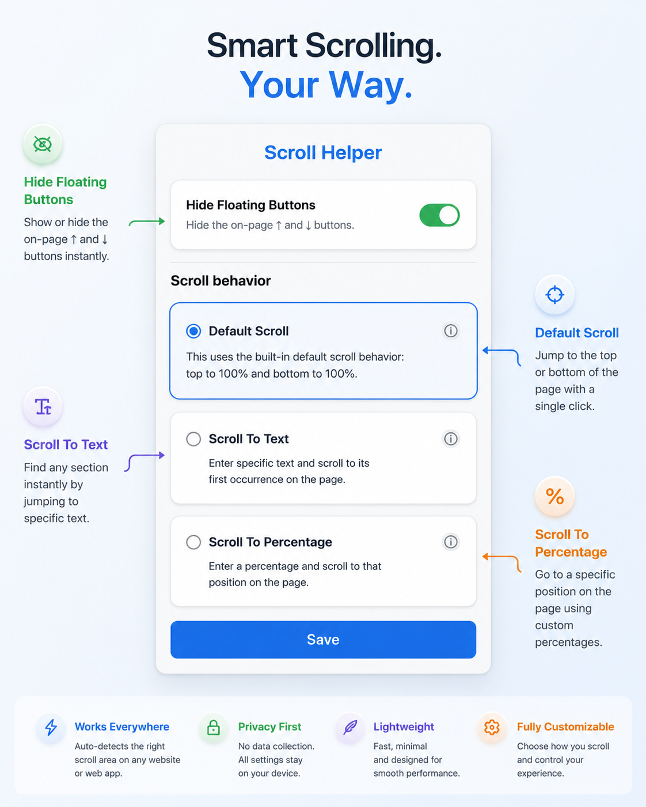

# Scroll Helper
A lightweight Chrome extension that adds customizable floating scroll buttons to every webpage.



Scroll Helper makes navigating long pages faster by letting you:

- ⬆ Jump to the top
- ⬇ Jump to the bottom
- Scroll to specific text
- Scroll to custom percentages
- Disable the buttons when not in need

It automatically detects the active scrollable area, making it work on both traditional websites and modern web applications.

---

## Features

### Default Scroll

The default mode behaves like traditional scroll buttons.

- ↑ Scroll to the top of the page
- ↓ Scroll to the bottom of the page

---

### Scroll to Text

Configure each button to jump to specific text on the page.

Example:

```
↑ Button → Introduction
↓ Button → Contact Us
```

The extension searches the page for the entered text and smoothly scrolls to the first matching result.

- Case-insensitive search
- Exact matches preferred
- Falls back to partial matches
- Displays a notification if no match is found

---

### Scroll to Percentage

Jump to custom positions on the page.

Example:

```
↑ Button → 10%
↓ Button → 10%
```

This scrolls:

- ↑ to 10% from the top
- ↓ to 10% from the bottom

---

### Hide Floating Buttons

Prefer a cleaner browsing experience?

Use the popup toggle to instantly hide or show the floating buttons.

---

### Smart Scroll Detection

Many modern websites use custom scroll containers instead of the browser window.

Scroll Helper automatically detects the active scrollable element and works on websites such as:

- ChatGPT
- GitHub
- Gmail
- Notion
- Jira
- Reddit
- X (Twitter)
- and many more

---

## Privacy

Scroll Helper respects your privacy.

It:

- Does **not** collect personal information
- Does **not** track browsing history
- Does **not** send webpage content anywhere
- Does **not** require an account

All settings are stored locally using Chrome Storage.

---

## Installation

### Chrome Web Store

Install directly from the Chrome Web Store:

> *(Add your Chrome Web Store link here once published.)*

---

### Install from Source

1. Clone the repository

```bash
git clone https://github.com/nishant-10/scroll-helper.git
```

2. Open Chrome

```
chrome://extensions
```

3. Enable **Developer Mode**

4. Click **Load unpacked**

5. Select the project folder

---

## Project Structure

```
scroll-helper/
│
├── manifest.json
├── popup.html
├── popup.css
├── popup.js
├── content.js
├── icons/
└── privacy.md
```

---

## Roadmap

Planned improvements include:

- Custom button position
- Custom themes
- Adjustable button size
- Keyboard shortcuts
- Favorite scroll locations
- Remember settings per website
- Improved text search performance
- Additional scrolling modes

---

## Support

Documentation and support:

- **Support:** support.md
- **Privacy Policy:** privacy.md

---

## Contributing

Bug reports, feature requests, and pull requests are always welcome.

If you discover an issue or have an idea for a new feature, please open an issue on GitHub.

---

## License

MIT License

---

Made with ❤️ to make navigating long webpages easier.